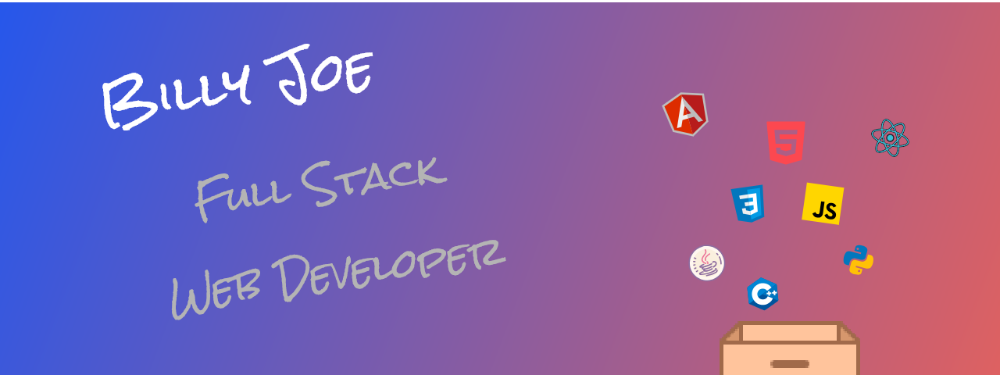

# Hello World 

My name is *Minhyeong Joe*, or simply *Billy* :sunglasses:

I graduated from University of California, Irvine in 2020 with the Bachelor's degree in Computer Science :man_student:

I am interested in **Web and Mobile development**, **UI/UX**, and **AI**.

Though I am a bit addicted to coding, I also love playing video games :video_game: and guitar :guitar: in my free time.

# :hammer_and_wrench: Skillset

